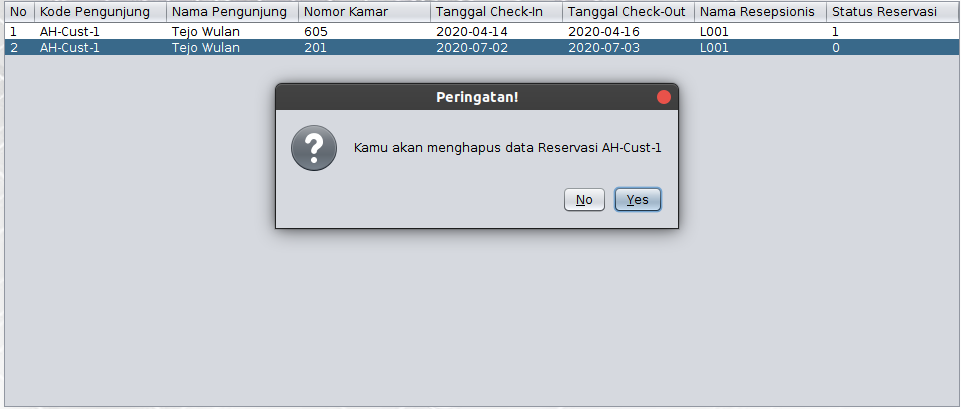
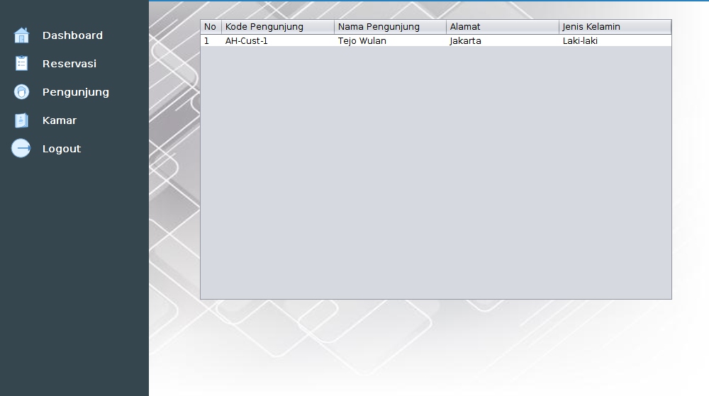
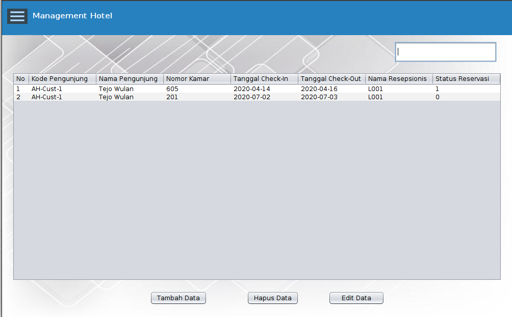
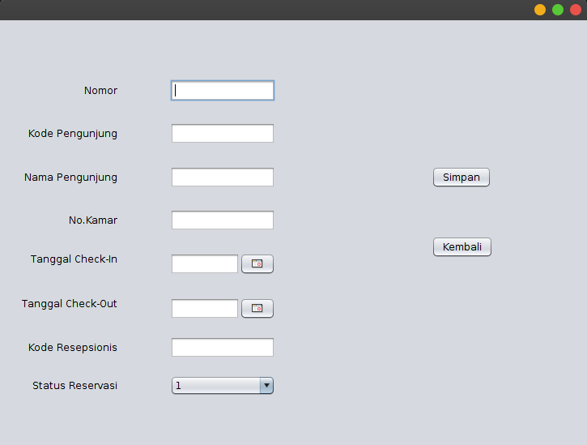
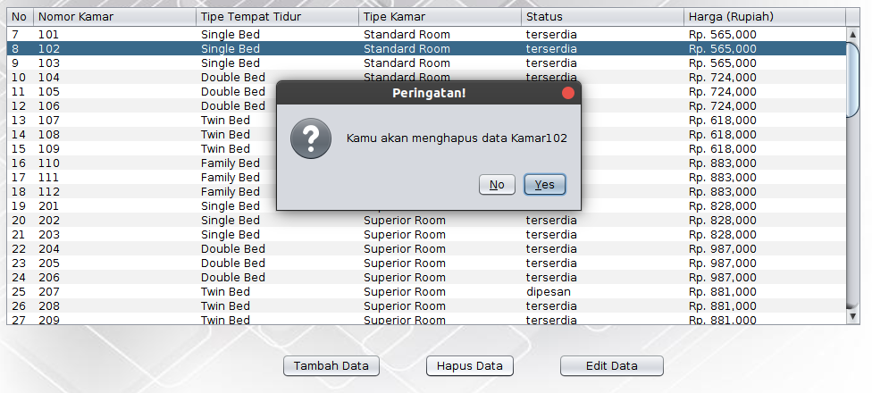
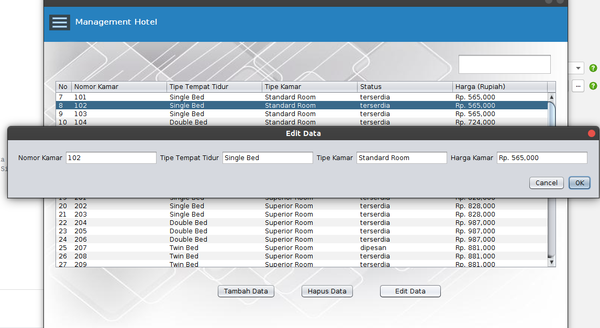
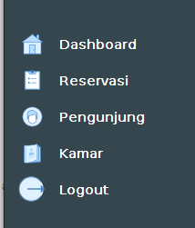

# Kolaborasi UAS
## Management Hotel
## 1. Aplikasi
    Management Hotel merupakan aplikasi berbasis desktop yang dikembangkan menggunakan bahasa pemrograman Java. Aplikasi ini dibuat dengan tujuan untuk meningkatkan pelayanan hotel serta mempermudah proses bisnis hotel. Terdapat 4 fitur yang ditawarkan untuk dapat mempermudah pengguna aplikasi ini yaitu sebagai berikut : 
        1. Dashboard 
        Merupakan halaman yang menyajikan informasi bagi penggunanya. Informasi yang diberikan dalam dashboard sebagai berikut : 
            - Jumlah Reservasi
            - Jumlah Pengunjung 
            - Jumlah Kamar 
            -Jumlah Kamar Dipesan
        2. Reservasi 
        Merupakan fitur yang dapat digunakan oleh pengguna untuk menampilkan data reservasi kamar hotel. Pengguna dapat menambahkan dan menghapus data reservasi kamar. 
        3. Pengunjung 
        Fitur pengunjung digunakan untuk mempermudah menampilkan data pengunjung hotel. 
        4. Kamar
        Merupakan fitur yang digunakan untuk menampilkan data kamar hotel. Pengguna dapat menambahkan, menghapus dan edit data kamar hotel. 

## 2. Instalasi 
### A. Instalasi Pada WIndows 
Setelah mengunduh dan melakukan Extract file, maka didalam folder project akan terdapat file .exe test yang akan dijalankan untuk proses pemasangan.

Kemudian ketika telah menjalankan file .exe test  yang telah tersedia maka akan muncul tampilan seperti berikut klik "OK".

Pada tahapan ini kita memilih No, untuk melakukan pemasangan pada directory yang berbeda, setelah itu klik "Next".

Tentukan Directory yang ingin kita jadikan tempat untuk aplikasi, kemudian klik "Next".

 
 Akan terdapat proses yang akan dijalankan, setelah selesai klik "Finish".

 

 Setelah selesai, cek directory yang digunakan untuk penyimpanan aplikasi pada tahap sebelumnya, akan terdapat file dengan extensi .exe kemudian double klik pada file tersebut maka aplikasi akan dapat digunakan.

 

## 3. Requirement 

## 4. Manual Penggunaan 
    Pada bagian ini akan dijelaskan mengenai tata cara menggunakan Aplikasi Management Hotel. 

    1. Melakukan instalasi dan memenuhi requirement sesuai yang dijelaskan pada poin ke-2 dan ke-3. 
    
    2. Setelah melakukan instalasi dan memenuhi requirement, untuk menggunakan aplikasi Management Hotel harus melakukan Login terlebih dahulu dengan mengisikan berupa username dan password sebagai berikut : 
        

        - Username : admin
        - Password : 1234 

    3. Fitur Dashboard 
    Setelah melakukan autentikasi berupa Login, maka pengguna akan diarahkan menuju Dashboard. 
    Pada fitur dashboard pengguna dapat melihat data jumlah reservasi, jumlah pengunjung dan jumlah kamar yang ada di Aplikasi Management Hotel. 

    4. Fitur Reservasi 
    Fitur reservasi merupakan fitur yang dapat digunakan oleh pengguna untuk menampilkan data reservasi kamar hotel.          Pengguna dapat menambahkan, mencari dan menghapus data reservasi kamar. 

        1. Untuk menambahkan data reservasi pengguna dapat memilih tombol Tambah Data
            - Untuk menambahkan data reservasi, pengguna harus mengisi form yang disediakan oleh aplikasi sebagai berikut : 

            
        2. Untuk menghapus data reservasi pengguna dapat memilih tombol Hapus Data 

        
   5. Fitur Pengunjung
   Fitur ini digunakan untuk menampilkan data pengujung dari hotel. 
   Untuk menggunakan fitur ini cukup klik pada tombol menu pengunjung. 
   Berikut tampilan pada fitur pengunjung : 
   
   
   
   6. Fitur Kamar 
   Merupakan fitur yang digunakan untuk menampilkan data kamar hotel.
   Pengguna dapat menambahkan, menghapus, mencari dan edit data kamar hotel. 
   Untuk menggunakan fitur ini klik pada menu kamar. 
   Berikut tampilan pada fitur Kamar : 
    
   
        1. Untuk Menambahkan data kamar pengguna dapat melakukan klik tombol Tambah Data
        selanjut nya mengisi form yang telah disediakan oleh aplikasi lalu klik tombol Simpan apabila selesai. 
    
    
        2. Untuk menghapus data pengguna memilih data yang ingin dihapus
        selanjutnya klik tombol Hapus Data seperti berikut : 
    
    
        3. Untuk mengedit data kamar pengguna memilih data kamar yang ingin di edit 
        selanjutnya klik tombol Edit Data selanjut klik tombol ok untuk menyimpan data seperti berikut : 
    
    
    
   7. Apabila telah selesai menggunakan aplikasi Management Hotel, pengguna dapat melakukan Logout dari aplikasi
   dengan klik tombol Logout pada bagian menu aplikasi 
    
        
        
        
    
